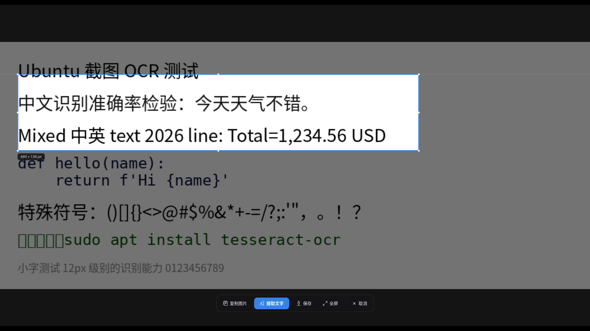
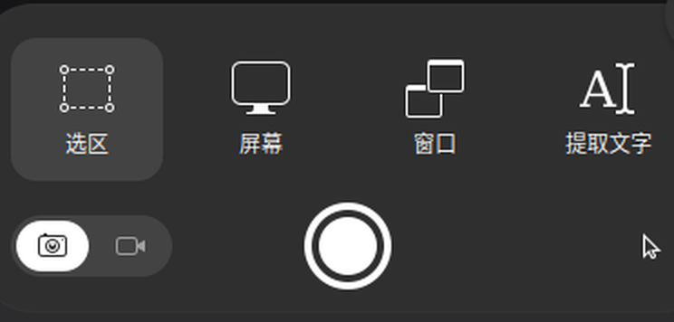

**English** | [中文](README.md)

# PrtScOCR — an OCR button for Ubuntu's screenshot tool

> macOS has Live Text; the Windows 11 Snipping Tool has "Text Actions".
> Ubuntu's screenshot UI has only ever had "Copy / Save". This project adds that missing piece:
> **press PrtSc, drag a selection, click "Extract text", and the text lands in your clipboard.**

All recognition happens locally; the screenshot never touches the network card, and it works offline.

The approach is to **add a button directly to GNOME's native screenshot UI** — through a GNOME Shell extension.

> We went down the wrong path once. We first assumed gnome-shell's internal UI was untouchable,
> so we took `Print` away from the native screenshot tool and drew our own overlay. It worked,
> but it **threw away screen recording too** — that was a replacement, not an addition. It's
> reverted now: `Print` belongs to the native tool again, and the button lives inside the native
> UI. §4.4 documents the whole investigation and implementation.



---

## 1. What it looks like

Pressing **PrtSc** opens the **GNOME native screenshot tool** — not an imitation of it. The
toolbar just has a fourth button (the screenshots below are from a real machine, not mockups;
the `Area` highlight is native behavior):



Left to right: `Area` / `Screen` / `Window` are the three native modes, and `Extract text` is
the fourth one this project adds. The row below (camera / record / shutter) is untouched too.

There are two ways to use it, either one works:

- **Click the button first**: click "Extract text" → the button becomes `Drag to select…`, and the
  placeholder selection on screen (border + four corner handles + the dimming shade around it)
  disappears, giving you a clean screen → drag to select → **recognition starts the moment you
  release** (this is its own selection mode, independent of the three native mode buttons above).
  As soon as you start dragging, the box and shade come back for live feedback; clicking the
  button again = cancel and restore.
- **Select first**: drag a selection directly → click "Extract text" → recognized immediately

On success: the text goes to the clipboard, a notification pops up, and the UI closes by itself
(consistent with the native shutter button, which closes once you press it).
While waiting for a selection, clicking the button again = cancel.

> Why doesn't clicking the button just OCR "the box that's already there when it opens"? The
> native UI puts a default selection covering about 1/4 of the screen in the middle as soon as
> it opens. That's only a placeholder box, and OCR'ing it is almost never what you want, so you
> have to make your own selection first.

Nothing native has been touched:

| Native feature | Status |
| --- | --- |
| Area / Screen / Window modes | As-is, the button just sits next to them |
| **Screen recording** (the "Record Screen" toggle at the bottom) | **Preserved as-is** |
| Show pointer, shutter, save to `~/图片` | As-is |
| `Print` / `Shift+Print` / `Alt+Print` | As-is (not hijacked) |

After recognition: ① the text is written to the clipboard; ② a notification appears (with a
60-character preview).

### Three entry points

| Entry point | What it does | Requires |
| --- | --- | --- |
| **PrtSc** → select → **Extract text** | Main path: OCR directly in the native screenshot tool | Shell extension (§2.2) |
| **Super+Shift+Y** | OCR **an image already in the clipboard** and replace it with text — the image can come from anywhere (`Shift+Print` area screenshot, `Alt+Print` window screenshot, right-click copy in a browser, an image someone sent you…) | `--with-clip-hotkey` |
| **Super+Shift+S** | Fallback standalone overlay screenshot tool (the Win11-style one, with a result panel for proofreading/merging lines) | Installed by default |

> `Super+Shift+S` is a leftover from that detour. It **doesn't conflict with any native key**,
> so it stays as a fallback (for example if a GNOME upgrade breaks the extension). If you don't
> want it: `python3 lib/keys.py remove` removes only the shortcut, or
> `python3 lib/keys.py install --no-…`, see §3.

`Super+Shift+Y` pairs especially well with native screenshots: `Alt+Print` to grab a window →
`Super+Shift+Y` → text. The native tool handles all the capture variants; we handle turning the
image into text.

## 2. Installation

```bash
git clone https://github.com/PeppaPig-114514/WaylandOCR.git ~/PrtScOCR
cd ~/PrtScOCR
./install.sh --with-extension --with-clip-hotkey   # no sudo needed anywhere
```

> The repository is named **WaylandOCR**, but every installed path uses `~/PrtScOCR` — so
> specify the target directory explicitly when cloning (as above). If you don't, you get
> `~/WaylandOCR`; relative paths like `bin/ocr` still work and the extension finds that
> location automatically (see §2.2), but the rest of this document assumes `~/PrtScOCR`.

What the installer does: installs an isolated Python environment (uv + rapidocr + onnxruntime),
registers a systemd user service (starts on login, restarts automatically on crash), writes the
application entry points, installs the GNOME Shell extension (which adds the "Extract text"
button to the native screenshot UI), and registers the clipboard-OCR shortcut.

> **Not a single native screenshot key is touched.** `Print` / `Shift+Print` / `Alt+Print` all
> stay at GNOME's factory settings, because we no longer need to take their keys — the button is
> already inside the native UI. (Early versions of `install.sh` unbound `Print`; rerunning it
> now restores that automatically.)

Optional flags:

```bash
./install.sh --with-extension        # install the "Extract text" button extension (§2.2)
./install.sh --with-clip-hotkey      # bind Super+Shift+Y = OCR the image in the clipboard
./install.sh --no-keybinding         # install the service only, register no shortcuts
./install.sh --binding '<Super>o'    # use a different key for the fallback overlay (default <Super><Shift>s)
./install.sh --take-print            # explicitly take over Print (displaces the native UI and screen recording; not recommended)
```

### 2.1 Current state on this machine

| Key | Behavior |
| --- | --- |
| `Print` | GNOME native screenshot UI (area/window/screen/recording), **with an extra "Extract text" button** |
| `Shift+Print` | GNOME native area screenshot |
| `Alt+Print` | GNOME native window screenshot |
| `Super+Shift+Y` | OCR the image in the clipboard → text |
| `Super+Shift+S` | Fallback standalone overlay screenshot tool |

### 2.2 That "Extract text" button (Shell extension)

The extension lives in `extension/prtsc-ocr@peppapig/` and is installed into
`~/.local/share/gnome-shell/extensions/` (a symlink, so editing the source needs no reinstall):

```bash
./bin/install-extension              # install + enable
./bin/install-extension status       # show status
./bin/install-extension --remove     # uninstall
```

**You must log out and back in once after installing** (on Wayland there's no way to restart
just gnome-shell). Why: GNOME only scans the extensions directory at startup, and `lookup()`
reads a table built at startup, so a UUID added at runtime is unknown to it — in practice
`gnome-extensions enable` just answers "extension does not exist".

After logging back in, verify:

```bash
gnome-extensions info prtsc-ocr@peppapig      # status should be ACTIVE
journalctl --user -b | grep '\[prtsc-ocr\]'   # should show two lines: "button added…" / "enabled"
```

Rollback:

```bash
./uninstall.sh            # stop the service, remove the entry points, uninstall the extension
./uninstall.sh --purge    # also delete the virtualenv and the logs
```

Nothing is left behind after uninstalling (everything is under your home directory; /usr was
never touched). Once you're sure you don't need it, just `rm -rf ~/PrtScOCR`.

**The OCR backend is configurable.** The extension itself is only UI; recognition is delegated
to an external program. The default path is `~/PrtScOCR/bin/ocr`; if you installed it somewhere
else, change it here:

```bash
gnome-extensions prefs prtsc-ocr@peppapig          # change it in the GUI
# or edit dconf directly
gsettings set org.gnome.shell.extensions.prtsc-ocr ocr-command '/your/path/ocr'
gsettings reset org.gnome.shell.extensions.prtsc-ocr ocr-command   # restore the default
```

When left empty, it picks the first one that exists out of `~/PrtScOCR/bin/ocr` and
`~/WaylandOCR/bin/ocr` (to cover the case where the repository name and the install directory
name differ).

The program being called must accept `--quiet <image path>` and print the text to stdout; exit
code `0` means success, `2` means there's no text in the image, and anything else counts as
failure (the last line of stderr is shown on the button).
`bin/install-extension` also compiles `schemas/` and `locale/` for you — a symlink install
doesn't compile them automatically the way `gnome-extensions install` does, and without that step
the preferences can't be read and the translations don't apply.

**UI language**: the extension's strings are gettext messages (the English source is the msgid),
with the Chinese translation in `po/zh_CN.po`. They follow the system language — a Chinese system
shows 「提取文字」, everything else shows `Extract text`. To add a language, drop in another
`po/<lang>.po` and run `./bin/compile-locales`. **This machine has no gettext at all (not even
`msgfmt`), so that script carries its own pure-Python .mo compiler** — no extra packages needed.

**Want to submit it to extensions.gnome.org:**

```bash
./bin/build-extension            # validate + package into dist/
./bin/build-extension --check    # validate only
```

Packaging uses the official `gnome-extensions pack`, and the result is a zip you can upload
straight to that site. See §11.

## 3. Usage

```bash
# launch the fallback overlay screenshot tool (this is what Super+Shift+S is bound to)
~/PrtScOCR/bin/prtsc-ocr
~/PrtScOCR/bin/prtsc-ocr --image image.png     # don't capture; select on an existing image

# The "Extract text" button is part of the Shell extension, not this CLI;
# to install/check/remove it: ~/PrtScOCR/bin/install-extension [status|--remove]

# OCR the image in the clipboard (this is what Super+Shift+Y is bound to)
~/PrtScOCR/bin/ocr-clip
~/PrtScOCR/bin/ocr-clip --dry-run                        # show the result only, leave the clipboard alone

# OCR an image from the command line (with `--no-autostart`, it errors out instead of quietly starting the service)
~/PrtScOCR/bin/ocr image.png
~/PrtScOCR/bin/ocr image.png --region 100,200,400,80      # OCR only that region
~/PrtScOCR/bin/ocr image.png --json                       # include coordinates/confidence
~/PrtScOCR/bin/ocr image.png --copy                       # also copy to the clipboard
~/PrtScOCR/bin/ocr screenshots/*.png --quiet              # batch

# service management
~/PrtScOCR/bin/ocrd status | restart | log | run | warm
```

`bin/ocr` exit codes: `0` success, `1` failure, `2` no text recognized, `3` service
unavailable — handy for scripting.

Also, no other program needs to know this project exists: `bin/ocr` reads ordinary image files,
so wiring it up from a file manager context menu, `xargs`, an editor plugin, and so on is
straightforward.

## 4. Design tradeoffs (why it's built this way)

### 4.1 Why not just use something off the shelf

Plenty of people have done screenshot OCR on Linux before; we looked at all of them:

| Project | Form | Why we didn't just use it |
| --- | --- | --- |
| [Native Screenshot UI OCR Extended](https://extensions.gnome.org/extension/10254/native-screenshot-ui-ocr-extended/) | **GNOME extension, adds a button directly to the native screenshot UI → Tesseract** | **The one whose final shape is closest to this project, see §4.1.1. The difference isn't the UI, it's the engine** |
| [NormCap](https://github.com/dynobo/normcap) | Python + Qt, select → Tesseract | Engine is Tesseract, clearly weaker than PP-OCR on Chinese; and it cold-starts a process plus an engine every single time |
| [TextSnatcher](https://github.com/RajSolai/TextSnatcher) | GTK/Vala + Tesseract | Same as above; unmaintained for a long time |
| [gocr (GNOME extension)](https://github.com/EvilX/gocr) | Extension draws its own selection overlay → Tesseract | It draws its own overlay and never enters the native UI; same Tesseract engine |
| Frog / gImageReader | Open an image, then recognize it | Not the "screenshot and it's already text" flow |

Conclusion: **copy the flow from the people before us (select → recognize → clipboard), swap out
the engine**, and turn the engine into a resident service.

#### 4.1.1 Relationship to EGO #10254

Let's be clear up front: **this project is not the first to "add an OCR button to the native
screenshot UI".**

[oreocapybara/gnome-native-screenshot-ui-ocr-extended](https://github.com/oreocapybara/gnome-native-screenshot-ui-ocr-extended)
(EGO [#10254](https://extensions.gnome.org/extension/10254/native-screenshot-ui-ocr-extended/),
published 2026-06) did it long ago, and **independently arrived at the same trick**: GNOME gives
extensions no plugin point at all, and the `org.gnome.Shell.Screenshot` D-Bus interface is
blocked by the `_senderChecker` allowlist, so both projects could only stuff a fourth button
into `ScreenshotUI._typeButtonContainer` — we even collided on the details, down to
`style_class: 'screenshot-ui-type-button'` and `x_expand: true`, because that's the only way in
the current Shell to make something "look native".

**So this project has no novelty at the UI level**, and we won't pretend otherwise. What's
genuinely different is what happens after the button is pressed:

| | #10254 | This project |
| --- | --- | --- |
| Engine | Tesseract | RapidOCR (PP-OCR, ONNX Runtime) |
| Recognition language | Called **without `-l`** → Tesseract defaults to `eng`; the schema has only four keys (shortcut / panel icon / notification / button position), **no language option** | Chinese first, with quantified results in `tests/` + `bench/` (3 wrong characters out of 1419) |
| Installation | Needs `sudo apt install tesseract-ocr` (Chinese also needs `tesseract-ocr-chi-sim`, and even then you can't select it) | **Zero sudo throughout**, uv installs into `~/.venv` |
| Swap the engine | Not supported | The preferences accept any `<program> --quiet <image>` |
| Line breaks | A single `\n` is merged into a space (written for prose) | Preserved as-is (code / terminals / tables don't get flattened) |
| Trigger | Click the button → drag-select → **click the native shutter** | Drag-select → **recognize on release** |
| Native buttons | Disables screen / window / recording / pointer during OCR | Doesn't touch a single one |
| Shell versions | 45–50 | 50 only |
| Other | Panel icon, configurable shortcut, CI / eslint / tests | None |

In one sentence: **same UI, different engines**. When #10254 calls `tesseract <image> stdout`
without `-l`, Tesseract defaults to the English model, making it **essentially unusable for
Chinese** — that's the reason this project exists. Conversely, it installs on GNOME 45–50 and
has a panel entry point and CI, which this project can't match yet.

### 4.2 Engine: RapidOCR (PP-OCRv6, ONNX Runtime)

* Mixed Chinese/English accuracy is far better than Tesseract, and the models ship with the
  package — **no network access**;
* Pure pip install, **no sudo**, doesn't touch system packages;
* Lives in `~/PrtScOCR/.venv` (an isolated Python 3.12 pulled in by uv), completely separate
  from the system Python.

### 4.3 Resident in the background, always ready

`lib/ocrd.py` is a UNIX socket service (`$XDG_RUNTIME_DIR/prtsc-ocr.sock`), managed by a systemd
user service (`Restart=always`; killed, it's back within 4 seconds).

The key idea is **moving the cold-start cost to startup time**: the first time onnxruntime
encounters a given input shape it has to allocate memory and run graph optimizations, so without
warming up, the first recognition after login takes more than 4 seconds. The service therefore
runs one pass at each of two real sizes, 1280×720 and 640×360, when it starts, and the `warm`
field returned by `ping` indicates that warming is done — the installer and the autostart logic
both wait for `warm`, not for "the model finished loading".

### 4.4 The two screenshot pipelines, and why we ended up with the extension

**Option A: capture the screen yourself and draw your own overlay** (this is what `Super+Shift+S`
uses).

| Approach | Result |
| --- | --- |
| `maim` / `scrot` / `import` | X11-only, unusable on Wayland |
| `grim` / `slurp` | Only supports wlroots compositors, not usable on GNOME |
| `org.gnome.Shell.Screenshot` (D-Bus) | Measured on this machine: **AccessDenied: Screenshot is not allowed**. In the source, `_senderChecker` lets through only two callers, `org.gnome.SettingsDaemon.MediaKeys` and `org.freedesktop.impl.portal.desktop.gnome` |
| `xdg-desktop-portal` Screenshot | ✅ `interactive=false` **silently** returns a full-screen PNG on GNOME 50, in about 0.5s, with no permission dialog |

Flow: silently grab a full-screen image → draw that **frozen frame** in our own full-screen
window → the user selects on the frozen frame → only the pixels inside the selection are sent to
OCR. The advantage is that the tool can never capture itself. The temporary file is read into
memory and **deleted immediately** (`PRTSC_OCR_KEEP_IMAGE=1` keeps it).

The cost: **it's an imitation**, not the native UI. We don't have GNOME's screen recording or
window capture, so we'd have to hijack the `Print` key to replace the native tool — which means
taking functionality away from the user. So we went with Option B instead.

**Option B: a GNOME Shell extension that adds a button to the native UI** (the main path; this is
what `Print` uses).

GNOME's native screenshot tool lives inside gnome-shell; the source is
`/org/gnome/shell/ui/screenshot.js` (3142 lines in GNOME 50, compiled into the gresource inside
`/usr/lib/gnome-shell/libshell-18.so`, which `gresource extract` can pull out).
It has no configuration options, no plugin points, and its D-Bus is open only to the same two
allowlisted callers (`InteractiveScreenshot` also goes through `_senderChecker`) — **but it can
be modified**: GNOME Shell extensions run in the same process as gnome-shell and can manipulate
its UI object tree directly.

The key structures (line numbers are for GNOME 50):

| Symbol | Line | Purpose |
| --- | --- | --- |
| `export const ScreenshotUI` | 1078 | The class for the whole screenshot UI, **already exported**, so extensions can import it |
| `this._typeButtonContainer` | 1265 | The container holding the three "area/screen/window" buttons |
| `IconLabelButton` | 53 | The class of those three buttons (not exported; copied with the same structure) |
| `screenshot-ui-type-button` | — | Their style class (in the Yaru theme's css) |
| `this._stageScreenshot` | 1173 | The frozen frame, the source of the pixels |
| `UIAreaSelector.getGeometry()` | 334 | Selection → `[x,y,w,h]` (**not** `_result`) |
| `UIAreaSelector`'s `drag-ended` signal | 254 | The moment of release, used for "recognize as soon as the selection is done" |
| `ScreenshotUI._getSelectedGeometry()` | 1871 | Selection → `[x,y,w,h]` |
| `Shell.Screenshot.composite_to_stream()` | 2416 | The actual pixel-fetching call |

So the extension does only four things: `import {ScreenshotUI}`; wrap its `open()` so that after
the UI opens it `add_child`s its own button into `_typeButtonContainer`; when the button is
clicked, copy the native "save screenshot" pixel path to crop the selection out of the **frozen
frame** (not a fresh screen capture, or the shade and the panel would be captured too); hand the
PNG to the resident OCR service, put the text in the clipboard, and close the UI.

**Four pitfalls we hit** (the first two are interaction bugs, the last two are API usage):

1. **The selection coordinates must come from `UIAreaSelector.getGeometry()`, not `_result`.**
   `_result` belongs to a different class, `SelectArea` (the D-Bus `SelectArea` set), and
   `UIAreaSelector` simply doesn't have that field. Measured: `'_result' in _areaSelector` →
   `false`. The consequence of using the wrong one is **failure on every click**, plus a bogus
   "please select an area first" — the user did select one, and it still isn't accepted.
2. **`Main.notify` won't pop up while the screenshot UI is open.** It's a modal grab state, so
   notifications only appear after the UI closes, which looks like "I clicked and nothing
   happened, then a message popped up on exit". So immediate feedback such as waiting/failure
   has to go on the button label (`Extract text` → `Drag to select…` / `Recognising…` / `No text
   found`), and notifications are just a record.
3. **`Gio.Subprocess.communicate_utf8_async` is not promisified, so you can't `await` it
   directly.** Awaiting it gives `At least 3 arguments required, but only 2 passed` — it wants a
   callback. gnome-shell only promisifies the handful screenshot.js itself uses
   (`composite_to_stream`, `screenshot_stage_to_content`, etc., see lines 19-24 of that file),
   so here you have to do `Gio._promisify(Gio.Subprocess.prototype, 'communicate_utf8_async')`
   yourself. Good news: `_promisify` is idempotent, so calling it repeatedly won't blow up.
4. **After promisifying, you get two values, `[stdout, stderr]`, not three.** Unlike
   `communicate_utf8_finish()`, the leading `success` boolean gets swallowed by promisify
   (failure rejects outright). Writing `const [, stdout, stderr] = ...` turns stderr into the
   recognition result: **recognition always returns empty and every error message is swallowed**,
   leaving you with nothing but "No text found".

One more thing that isn't a pitfall but is easy to miss: `bin/ocr`'s exit code **2 means "the
image is fine, there just isn't any text"**, not failure. Treating it as failure makes selecting
an empty area pop up "Extract text failed" instead of the friendlier "No text found".

**"Hiding the selection box" also depends on internal structure:** that box is made of a
`UIAreaIndicator` (4 `screenshot-ui-area-indicator-shade` dimming shades + 1 `...-selection`
border) plus 4 `screenshot-ui-area-selector-handle` handles. There is **not a single**
`show()`/`hide()` anywhere in `UIAreaSelector`, i.e. the native code never changes their
visibility — so if you hide them, you're responsible for putting them back: restore them on
`drag-started` (you need to see them while dragging), and also on cancel / reopening the UI /
`disable()`, otherwise you leave the user's native interface in a "the box is gone" state.
Hiding only the border and not the shade is useless: the bright rectangle in the middle is still
a box.

We have to wrap `open()` rather than `_init()`: the `Main.screenshotUI` singleton is `new`ed
when the shell starts (`main.js:260`), by which time `_init` finished long ago and the extension
has no chance to get involved.

Everything the extension depends on is a private field, and a GNOME version bump may rename it —
so every access is existence-checked, and if something really is renamed the button reports it
instead of crashing the shell. This is a common problem with all GNOME extensions.

**Verified on a real machine** (using a temporary headless shell, so the desktop session wasn't
disturbed):

```
gnome-shell --headless        # separate dbus session, no windows
  → gnome-extensions info prtsc-ocr@peppapig
    State: ACTIVE

  → _typeButtonContainer child count=4
      child[0] screenshot-ui-type-button label=Area
      child[1] screenshot-ui-type-button label=Screen
      child[2] screenshot-ui-type-button label=Window
      child[3] screenshot-ui-type-button label=Extract text   ← the one we added
    Shell.Screenshot.composite_to_stream: function
```

All three native buttons are still there (none got pushed out), and ours is the fourth with the
same style class — which is why it looks the same.

Option A's overlay is kept as a fallback (`Super+Shift+S`); it doesn't conflict with any native
key.

### 4.5 Shortcuts: gsettings is the only way

On Wayland, ordinary programs can't listen for global keyboard input (X11's `XGrabKey` was
removed entirely), so custom shortcuts can only be forwarded by the compositor. This project
uses GNOME's **`media-keys custom-keybindings`**:

| Key | Command | Notes |
| --- | --- | --- |
| `<Super><Shift>s` | `bin/prtsc-ocr` | Fallback overlay |
| `<Super><Shift>y` | `bin/ocr-clip` | Clipboard image OCR (optional) |

**`show-screenshot-ui` is left alone.** Early versions cleared it to monopolize `Print`, which
cost users their screen recording; now `Print` belongs to the native tool and the main entry
point's button comes from the extension (§4.4). By default `lib/keys.py install` also checks
whether this key was ever cleared, and restores it if so.

To change a key: `lib/keys.py install --binding '<Super>o'`, or GNOME Settings → Custom
Shortcuts. `./uninstall.sh` removes these entries; `state/gnome-keys-backup.json` keeps the
original values.

## 5. Configuration

Everything is configured through environment variables (edit `Environment=` in the systemd unit,
then `bin/ocrd restart`):

| Variable | Default | Notes |
| --- | --- | --- |
| `PRTSC_OCR_LIMIT_TYPE` | `max` | Detection model scaling policy. **Don't change it back to `min`** — the library default `min/736` upscales the short side of small images to 736 (420×120 becomes 2576×736); measurements show no accuracy gain at all and 25× the runtime |
| `PRTSC_OCR_LIMIT_SIDE` | `960` | Upper bound on the longest side of the detection input. Measured: 960 and 1280 give identical per-image results, and 960 is faster on small images, so there's no reason to use 1280 |
| `PRTSC_OCR_DET_MODEL` | `small` | One of `tiny` / `small` / `medium` / `mobile` / `server` (more accuracy ↑, less speed ↓; the models are bundled) |
| `PRTSC_OCR_REC_MODEL` | `small` | Same as above |
| `PRTSC_OCR_OCR_VERSION` | `PP-OCRv6` | `PP-OCRv5` is also available (v5 requires `mobile`)|
| `PRTSC_OCR_BOX_THRESH` / `PRTSC_OCR_THRESH` | `0.45` / `0.25` | Detection box thresholds; lower them if you're missing a lot of text |
| `PRTSC_OCR_PANEL` | `1` | Whether to show the result panel after recognition (`0` = straight to the clipboard, silently) |
| `PRTSC_OCR_KEEP_CAPTURE` | `0` | Whether to keep the raw screenshot written to disk by the portal |
| `PRTSC_OCR_SOCK` | see above | socket path |

> Model names are case-insensitive; you can write either the enum name or the enum value (`TINY`
> and `tiny` are equivalent, `PPOCRV6` and `PP-OCRv6` are equivalent).
>
> **Should you switch to `tiny`?** `tiny` is more than twice as fast (measured on this machine:
> a small region goes from 106ms to about 50ms), and on plain Chinese prose, Chinese+digits,
> low-contrast gray text, and two-column paragraphs it shows **no measurable difference** from
> `small`; but it fails systematically on three kinds of content (`bench/RESULTS.md` §5.3 has
> examples):
> ① ASCII case and `O`/`0` confusion (`RapidOCR`→`RapidocR`, `Ctrl+Shift+O`→`Ctrl+Shift+0`);
> ② full-width punctuation folded to half-width (`！？`→`!?`, `（）`→`)`);
> ③ code punctuation spacing (`def main():`→`def main() :`).
> So **if you often select code, command lines, serial numbers, or keyboard shortcuts, stay on
> `small`**.

Restart the service after changing anything:

```bash
# Option 1: try it temporarily
PRTSC_OCR_DET_MODEL=tiny PRTSC_OCR_REC_MODEL=tiny bin/ocrd run --foreground

# Option 2: write it into the systemd unit to make it stick
systemctl --user edit prtsc-ocr.service     # add an Environment= line
bin/ocrd restart
```

## 6. Measured performance and accuracy

### 6.1 Accuracy (independent of machine load, so the numbers are reliable)

Measured with `bench/bench.py`: 12 samples, 1419 non-whitespace characters, covering 12px small
text, dense prose, low contrast, dark terminals, two-column layout, full-width symbols, and a
full 1080p screen. The full report is in **[bench/RESULTS.md](bench/RESULTS.md)**.

**CER = character error rate.** The headline CER is dominated by space differences between
Chinese and English (35–47 edits come from spaces, while real character errors are only 0–8), so
the table below is sorted by "real character errors" — for the purpose of "drop the text into
the clipboard", that's the number worth looking at.

| Configuration | Non-whitespace character errors | CER ignoring spaces | Headline CER |
| --- | --- | --- | --- |
| v6 medium | 1 / 1419 | 0.002 | 0.027 |
| Library default `min/736` (small) | 3 / 1419 | 0.004 | 0.027 |
| **This machine's default: `max/960` (small)** | **3 / 1419** | **0.004** | 0.031 |
| tiny detection + small recognition, `max/960` | 3 / 1419 | 0.004 | 0.032 |
| v5 mobile, `max/960` | 6 / 1419 | 0.007 | 0.038 |
| v6 tiny, `max/960` | 8 / 1419 | 0.011 | 0.040 |

Three conclusions:

1. **The library default `limit_type=min` is a pure loss.** It upscales a 420×120 selection to
   about 2576×736 (short side to 736), taking 1.9–2.1 seconds for a small region, while the
   character error count is exactly the same as `small/max` (3/1419 both). Mechanically, `min`
   is the assumption of "scanning a whole document page, worried that small text is illegible";
   on "screen captures that are already sharp" it just burns compute for nothing. Changing it to
   `max` is the single most valuable line of configuration in this project.
2. **Don't upscale images before recognition.** We once thought "upscaling a small image can
   save small text"; measurement (`RESULTS.md` §4.8 plus re-verification on this machine) shows
   **character-for-character identical** results on the 12px sample, while latency doubles or
   triples (420×120 region: 250ms → 91ms). So that "upscale 2× if smaller than 480px" heuristic
   in `lib/ocrd.py` has been deleted.
3. **`limit_side_len` 960 and 1280 give identical per-image results**, so there's no reason to
   use 1280.

### 6.2 Latency (measured on an idle machine, current default configuration)

Median of 9 runs, with only this project's own resident service on the machine:

| Selection content | Median | P95 | Fastest |
| --- | --- | --- | --- |
| Small region of 12px text (420×120) | **106 ms** | 146 ms | 93 ms |
| A typical line of text (680×130) | **200 ms** | 250 ms | 169 ms |
| A paragraph (900×420) | 230 ms | 350 ms | 214 ms |
| A settings dialog (560×300) | 345 ms | 427 ms | 282 ms |
| The whole 1080p screen (worst case) | 2498 ms | 2908 ms | 2313 ms |

> **Don't be misled by the absolute timings in the benchmark report**: as soon as
> `bench/bench.py` runs, onnxruntime uses all 6 physical cores, and this project's own resident
> service normally takes about 1 core, so the latencies in the report are an **upper bound** (the
> same configuration can differ by 20%+ between two runs). The table above was re-measured after
> freeing up the machine.
> Accuracy (CER) isn't affected by load, so the table in §6.1 can be trusted as-is.

Fixed overhead: screen capture (silent portal) is about 500 ms.

Resident memory: about 160–200 MiB for normal selections; after a large image such as a full
screen it grows to about 460 MiB and then **stays there**. It isn't a leak — rapidocr already
disables onnxruntime's CPU memory pool by default (`enable_cpu_mem_arena: false`); what grows is
the allocator keeping freed large blocks in the process for reuse instead of returning them to
the OS. Measured at that level, another 33 recognitions of various sizes grew it by only 9 MiB.

**End to end: press PrtSc → select → click "Extract text" → text in the clipboard, about 0.7
seconds**, of which OCR itself accounts for only about 0.2 seconds.

## 7. Self-checks and troubleshooting

```bash
# a set of end-to-end assertions (runs on a private socket, doesn't disturb the service in use)
~/PrtScOCR/.venv/bin/python ~/PrtScOCR/tests/smoke_test.py

# service status / logs
~/PrtScOCR/bin/ocrd status
~/PrtScOCR/bin/ocrd log
```

| Symptom | What to do |
| --- | --- |
| **Pressing Print opens the native screenshot tool, but there's no "Extract text" button** | The extension didn't load. First run `gnome-extensions info prtsc-ocr@peppapig`:<br>· It says "extension does not exist", or the state isn't ACTIVE → **log out and back in once** (GNOME only scans the extensions directory at startup, §2.2)<br>· The state is ERROR → `journalctl --user -b \| grep prtsc-ocr` to see the error; usually a GNOME upgrade changed an internal structure (§4.4)<br>· It was auto-disabled → `gnome-extensions enable prtsc-ocr@peppapig` |
| Clicking the button does nothing | Look at the button text: if it turned into `Drag to select…`, it's **waiting for you to drag a selection** (release to recognize), not stuck; click again to cancel |
| The button shows `No selection yet` | No valid area was dragged, or the drag was too small (width and height must be > 1 pixel) |
| The button is there but shows "couldn't get the screen freeze frame" | Screen capture failed; it's not an OCR problem |
| Pressing Print does nothing | Run `python3 lib/keys.py status` to see whether the native key was changed; it should be `show-screenshot-ui = ['Print']`. If it isn't, rerun `./install.sh` |
| Pressing Print brings up **our** overlay instead of the native UI | `show-screenshot-ui` was unbound (early versions did this). Rerunning `./install.sh` restores it automatically; or `gsettings set org.gnome.shell.keybindings show-screenshot-ui \"[\'Print\']\"` |
| **A message says "portal screenshot denied (response=2)"** | See §7.1 below; this is the Ubuntu portal's authorization mechanism, not a broken capture |
| Screen capture fails / times out | Confirm you're in a Wayland session (`echo $XDG_SESSION_TYPE`); if the portal service is misbehaving, `systemctl --user restart xdg-desktop-portal-gnome` |
| Recognition is inaccurate | Select a smaller region and avoid translucent/artistic text; **include the whole line of text in the selection** — if the box cuts right through the middle of a character, the sliced-off lower half can turn "天" into "于" (we measured this). Better to include a little extra margin |
| Want more accuracy/speed | Change the model in §5 (`medium` is more accurate, `tiny` is faster), or adjust `PRTSC_OCR_BOX_THRESH` |
| The first recognition is very slow | Warming hasn't finished yet (check `warm` in `ocrd status`); or run `bin/ocrd warm` manually |
| Pasting the clipboard produces no image | It needs `wl-clipboard` (`sudo apt install wl-clipboard`) |
| **OCR text pastes fine, but isn't in Clipboard Indicator's history** | **This is its own bug, not this project's** — this project only makes one standard `St.Clipboard.set_text` call. Two known causes:<br>① **Privacy mode** is on (`Ctrl+F8`, which silently stops recording and hides the entire history);<br>② It puts the clipboard listener setup `_setupListener()` inside `_buildMenu().then()` with **no `.catch()`** — once that promise never settles, it never listens to the clipboard again, **without logging a single line**.<br>**Logging out and back in fixes it** (`disable`/`enable` isn't guaranteed, because GNOME caches already-loaded extension modules). |

### 7.1 Why the fallback overlay reports `response=2`

> **This section applies only to Option A in §4.4 (the `Super+Shift+S` overlay).** The main entry
> point, the "Extract text" button, goes through the Shell extension and fetches pixels through
> gnome-shell's internal interfaces, **without going through the portal at all**, so it doesn't
> have this problem.

**Symptom**: after pressing the shortcut, a notification says "capture failed: portal screenshot
denied (response=2)", yet running `bin/prtsc-ocr` manually from a terminal works perfectly. Both
of these lines show up in the log:

```
systemd[2950]: Started app-gnome-prtsc\x2docr-166076.scope - Application launched by gsd-media-keys.
xdg-desktop-portal[3753]: Failed to show access dialog: AccessDenied:
  Only the focused app is allowed to show a system access dialog
```

**Cause**: which callers the portal allows to take a screenshot is decided by the caller's
**app-id**, and the app-id is derived from the process's **cgroup**. GNOME shortcuts are handled
by `gsd-media-keys`, which launches commands through systemd "application scopes" — so the
process lands in `app-gnome-prtsc-ocr-<pid>.scope`, and the portal infers an app-id of
`gnome-prtsc-ocr`. That app-id has never been authorized, so the portal wants to show an "allow
screenshot?" dialog; but that dialog **can only be shown by a foreground application**, and this
tool captures first and creates its window afterwards, so at request time there's no window yet
→ not foreground → the dialog can't be shown → outright denial, `response=2`.

Why running from a terminal is fine: the process isn't in an `app-*.service/scope` then, so the
portal can't identify a specific application and treats it as **host (empty app-id)**, and host
is already authorized in the permission store (that's the path system tools like
`gnome-screenshot` take).

**Fix**: `bin/prtsc-ocr` first puts itself into a **neutrally named transient scope**
(`run-*.scope`) and then runs, so the app-id goes back to empty and hits an existing
authorization. No "allow" click is needed, and the system permission store doesn't have to be
changed. Two related switches:

```bash
PRTSC_OCR_NO_SCOPE=1 ~/PrtScOCR/bin/prtsc-ocr   # disable this wrapping, for A/B verification
```

To tell which case you're in, look at `~/PrtScOCR/logs/snipper.log` — every start logs its own
cgroup and wrapper status (when launched from a shortcut, stderr goes only to the journal, so
it's easy to miss):

```
2026-09-29 09:14:55 start pid=168147 args=[...] cgroup=.../run-p168147-i174798.scope　neutral scope wrapper=yes
```

- `cgroup` is `run-*.scope` and wrapper=`yes` → normal, using host authorization.
- `cgroup` is `app-*.service`/`app-*.scope` and wrapper=`no` → it didn't go through
  `bin/prtsc-ocr` (for example someone called `lib/snipper.py` directly); switch back to
  `bin/prtsc-ocr`.

To check the permission store yourself (when `flatpak` isn't installed):

```bash
gdbus call --session --dest org.freedesktop.impl.portal.PermissionStore \
  --object-path /org/freedesktop/impl/portal/PermissionStore \
  --method org.freedesktop.impl.portal.PermissionStore.Lookup screenshot screenshot
# → ({'': ['yes']}, <byte 0x00>)   # empty app-id (host) is already authorized
```

## 8. Known limitations

* **Only verified on GNOME Wayland** (this machine: GNOME 50 / Ubuntu 26.04). KDE has a different
  portal and shortcut mechanism and would need separate work (`lib/capture.py` uses the standard
  portal, so it should be reusable in principle).
* **Multiple monitors**: the frozen frame size comes from the portal (currently the union of all
  screens), the window is centered and scaled to fit, and coordinate conversion already handles
  `scale/offset`; but this machine has only one 1920×1080 display, so multi-monitor with
  fractional scaling has never been tested.
* **Single-line mode has a pitfall, already worked around**: rapidocr's `RapidOCR.__call__` writes
  `use_det` into instance state, so a single `use_det=False` call contaminates every later call
  (the symptom is that subsequent recognitions return one or two garbage characters).
  `lib/ocrd.py` now passes `use_det` / `use_cls` explicitly on every call, and
  `tests/smoke_test.py` locks "normal recognition still works after single-line recognition" in
  as a regression case.
* **Layout reconstruction is heuristic**: the line-grouping threshold is 0.6× line height and the
  inter-word space threshold is 0.55× line height, both empirical values; it only works for
  "well-behaved multi-column/form" content. Complex layouts in real interfaces (irregular cards,
  mixed text and images) may come out with the wrong line order — in the benchmark report, using
  a naive line-first order on the two-column sample sends CER from 0.011 to 0.77. Single lines of
  text are accurate in themselves; "restoring the layout" is best-effort.
* **The `tiny` model has three classes of systematic errors** (unless you switch models, see §5):
  ASCII case and `O`/`0` confusion, full-width punctuation folded to half-width, and code
  punctuation spacing. Defaulting to `small` is precisely to avoid these.
* The first view is a **frozen frame** (capture first, then select), not live preview like Win11 —
  that's an inherent limitation of the portal approach, traded for not needing a GNOME extension
  and not depending on internal shell APIs.
* **Putting a fourth button in the top row may trigger a Shell layout bug**: after suspend or
  screen blank, that row gets stretched to the full screen width. This was [confirmed on a real
  machine by the author of
  #10254](https://github.com/oreocapybara/gnome-native-screenshot-ui-ocr-extended) —
  `_typeButtonContainer` is a homogeneous container, and once the children go from 3 to 4, a
  relayout triggered by suspend/blank expands the container and all children to the same full
  width. **We couldn't reproduce it on this machine** (it needs a real suspend to trigger), but
  since they went out of their way to change the default layout for it, it's credible enough. If
  you do hit it: **close the screenshot UI and open it again** and it recovers. #10254's
  workaround is to put the button in the bottom row instead (icon mode, next to "Show Pointer") —
  if you care more about stability than about sitting next to Area/Screen/Window, you can do the
  same (what you'd change is the mount position in `makeTypeButton` in `extension.js`).

## 9. Directory structure

```
PrtScOCR/
├── install.sh / uninstall.sh     one-shot install / rollback (neither needs sudo)
├── extension/
│   └── prtsc-ocr@peppapig/       GNOME Shell extension: adds "Extract text" to the native screenshot UI
│       ├── metadata.json         extension metadata (including the GSettings schema declaration)
│       ├── extension.js          all the logic: add the button, select, fetch pixels, call OCR
│       ├── prefs.js              preferences UI (change the OCR backend path)
│       ├── LICENSE               GPL-3.0-or-later
│       ├── schemas/              GSettings schema (gschemas.compiled is a build artifact)
│       └── locale/<lang>/LC_MESSAGES/*.mo   compiled translations (build artifacts too)
├── po/
│   └── zh_CN.po                  Chinese translation (the English source is the msgid)
├── bin/
│   ├── install-extension         install/uninstall that extension
│   ├── build-extension           package into a zip ready for extensions.gnome.org
│   ├── compile-locales           .po to .mo (works without msgfmt)
│   ├── prtsc-ocr                 launch the fallback overlay (what Super+Shift+S is bound to)
│   ├── ocr                       command-line recognition
│   ├── ocr-clip                  OCR the image in the clipboard
│   └── ocrd                      service management
├── lib/
│   ├── snipper.py                GTK4 frozen frame + selection + toolbar (system python3)
│   ├── capture.py                silent portal screen capture
│   ├── ocrd.py                   resident OCR service (venv python)
│   ├── ocr_client.py             socket client (stdlib only)
│   └── keys.py                   GNOME shortcut registration / rollback
├── config/                       systemd units and .desktop templates
├── tests/smoke_test.py           end-to-end self-check (22 assertions, runs on a private socket)
├── bench/                        accuracy-latency benchmarks
│   ├── bench.py                  synthesizes 12 test images + runs the full evaluation (about 11 minutes)
│   ├── RESULTS.md                ← the benchmark report; all the selection rationale is here
│   └── summarize.py / analyze_errors.py   produce tables / classify errors
├── docs/overlay.png              UI screenshot
└── state/                        pre-install GNOME keybinding backup (used for rollback)
```

> `bench.py` synthesizes its own test images and writes them into `bench/samples/`; the ground
> truth is the string used to render them, with no manual transcription step, so the whole report
> is reproducible from scratch.

## 10. License and provenance

This project's code is original and released under **GPL-3.0-or-later** (see `LICENSE`; the same
family as gnome-shell itself, so submitting to extensions.gnome.org raises no licensing issue).
The OCR capability comes from the open-source project
[RapidOCR](https://github.com/RapidAI/RapidOCR) (Apache-2.0), and the models are PaddleOCR's
PP-OCR series (Apache-2.0). The flow design drew on prior work such as NormCap / TextSnatcher /
gocr from the table above, with thanks.

## 11. Publishing on extensions.gnome.org

Repository: <https://github.com/PeppaPig-114514/WaylandOCR>

### Packaging

```bash
./bin/build-extension            # validate + package into dist/
./bin/build-extension --check    # run validation only
```

The artifact is `dist/prtsc-ocr@peppapig.shell-extension.zip`, produced with the official
`gnome-extensions pack`; the script checks the publishing requirements one by one:

| Check | Why |
| --- | --- |
| `metadata.json` at the **root** of the zip | The site looks for metadata in that location; an extra directory level gets rejected |
| `uuid` / `name` / `description` / `shell-version` all present | Needed for the listing page |
| `shell-version` contains plain numeric versions only | `"50.1"` or a future version gets bounced |
| `url` must not be a placeholder | The listing page displays the homepage |
| The schema passes `--strict` validation | Typos in key names get caught right here |
| After unpacking, `gjs -m` can parse `extension.js` / `prefs.js` | Prevents uploading broken files |
| The zip contains no `gschemas.compiled` | That's a build artifact and is regenerated at install time |

### Submitting

1. https://extensions.gnome.org/upload/ , log in with your GNOME account
2. Upload the zip; the site reads `metadata.json` itself
3. It enters the review queue (usually days to weeks); until it's approved, only you can install it

### What reviewers will care about

Honestly, this extension uses gnome-shell's **private internals** (`ScreenshotUI`'s
`_typeButtonContainer`, `_stageScreenshot`, `UIAreaSelector`, etc., see the table in §4.4). This
isn't carelessness, it's **currently the only way to add a button to the native screenshot UI**:
GNOME provides no plugin point, and D-Bus only lets through the two allowlisted callers,
gsd-media-keys and the portal (the `_senderChecker` in the source).

It's worth calling this out proactively in the submission notes, and emphasizing that:

- every private-field access is existence-checked, so if the structure changes it degrades to
  "the button shows a message" and **won't crash the shell**;
- not a single native feature was touched, and `Print` / `Shift+Print` / `Alt+Print` are all
  factory bindings (with regression tests guarding them, see `tests/`);
- recognition happens entirely on the local machine, and the extension itself makes no network
  calls.

Also, **the UI is gettext-enabled now**: the English source strings in the code are the msgids
and the Chinese translation lives in `po/zh_CN.po`, compiled into `locale/`, following the system
language. So an English system shows `Extract text` while a Chinese one still shows `提取文字`.
`name` and `description` in `metadata.json` stay **inline bilingual** — the extension store is not
guaranteed to translate metadata, and inline is the safest.

### Reviewers will ask "how is this different from #10254"

Answer it proactively (and put it in the submission notes): **the UI idea is the same; this
project's novelty is the engine** — #10254 calls Tesseract without `-l`, defaults to the English
model, and is unusable for Chinese; this project bundles PP-OCR Chinese/English models, needs
zero sudo, has a swappable backend, and has benchmarks. The full comparison is in §4.1.1.

### How other people use it after installing

The extension is only UI; **recognition needs a local OCR backend**. Others just point "OCR
program path" in the extension preferences at their own backend; §2 of this `README` is the
complete installation procedure for that backend.
